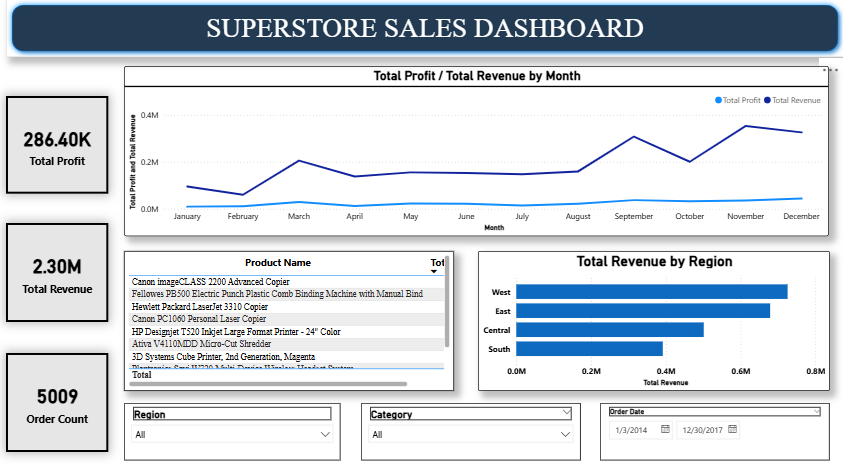

# Superstore Sales Analysis

## About the project

This project analyzes Superstore sales data using Power BI and DAX.

## Tools Used

- Power BI
- DAX
- Power Query

## Analysis

This dashboard includes:

- Total Revenue
- Total Profit
- Profit Margin
- Order Count
- Sales by Region
- Top 10 Most Profitable Products
- Monthly Sales and Profit

## Project File

The Power BI file is available in this repository:

Superstore sales dashboard.pbix

## Dashboard

